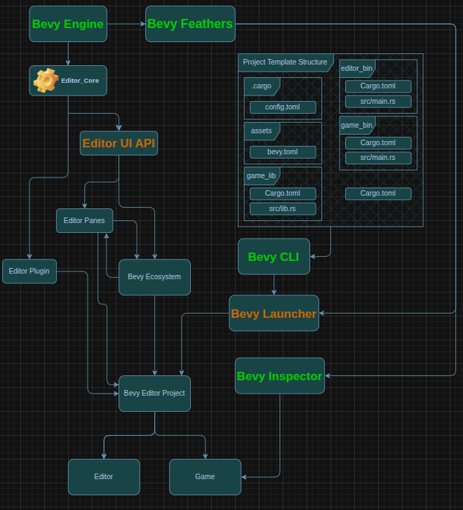

# Architecture

Bevy's editor, like the rest of Bevy, is fundamentally designed to be modular, reusable, and robust to weird use patterns.
But at the same time, a new user's initial experience should be polished, reasonably complete and ready to jump into.

These goals are obviously in tension, and to thread the needle we need to think carefully about our project architecture, both organizationally and technically.

So far, we've agreed upon a general architecture for a MVP release:



- All Bevy Engine tooling will live within the main repo, and must be updated and fixed as part of the ordinary development process.

- The Editor is built as a plugin within the user's project.
  - Explanation/Reasoning:
    - In order for the editor to display components (and other data) that a entity and by extension a BSN file, can be created with. The Editor must have access to the reflection type data. Rust currently has no built in reflection support and theres no tooling from which the editor could extract this data without being constrained by a validly compiled and running game project binary.
    - The only option that has the least risk, maintenance requirements, and time, is to have the Editor compiled together with the user's project allowing the Editor's type registry to have all the necessary data for creating and loading BSN files.
    - In the future we should look to break away from this hard requirement as if forces a specific file structure on users and isn't how editors traditionally work in game development.
  
  - The Editor only focuses on the scene creation workflow.
  - Explanation/Reasoning:
    - All development workflows that require live game interactions, such as running the game inside the editor window, create a exponentially harder architecture problem.
    - It will be easier for Bevy maintainers to develop those interactions separately via the Inspector until post MVP where both efforts can be merged when they are ready.
  
  - The Editor can only have features that are naturally available within default Bevy.
    - IE: A physics simulation based entity placement tool can only be added *after* a physics engine is added to Bevy main.
  
  - The Editor MVP should only be shipped once a few basic tools are added.
  - Basic tools here is defined as tools absolutely necessary for the base workflow of "create a scene out of entities/assets" and tools that facilitate the use of those tools such as object gizmos etc.
    - 3d Scene-Viewer pane
    - 2d Scene-Viewer pane
    - Scene tree pane
    - Component/Entity properties pane
    - Basic project file tree pane
  
  - The Editor UI operates in a structure similar to how Bevy is built of the `bevy_ecs` crate via a new crate `bevy_editor_core`.
    - To prevent a complex structure of queries and observer conflicts and constant resource fighting, `bevy_editor_core` will handle constructing and managing the UI.
    - Explanation/Reasoning:
    - In order to achieve a cohesive experience within the Editor while also enabling community additions `bevy_editor_core` is where an API will be developed that allows plugins to do things such as, declare bsn of a component, struct, or even declaring bsn for an entirely new pane for the editor and just as bevy's cornerstone is the ecs all editor features must be implemented through this api.
    - This ensures we feel pain points in the api before users can.
    - This api has two possible paths with pros and cons to both and needs more design work. Examples of the possible paths below.

The possible reflection based api:

```rs
#[derive(Reflect, Component)]
#[reflect(editor_location(SnapTools))]
#[component(on_add(ButtonCallbackFunction))]
pub struct PluginButton;

Impl EditorUi for PluginButton {
    fn scene() -> Scene {
        bsn!()
    } 
}
```

and the plugin build based api:

```rs
impl Plugin for MyEditorPlugin {
    fn build(&self, app: &mut app) {
        app.editor.modify_pane::<3DScenePane>(/*INSERT BSN ASSET PATH HERE*/);
        app.editor.register_component_widget::<Component>(/*INSERT BSN ASSET PATH HERE*/);
        ...
    }
}
```

- It should be explored if its possible to combine these two api formats to gain the power of both.

- The Bevy Launcher is a binary application made using `bevy`, `bevy_feathers`, and `bevy_cli`
  - A non-programmer user will create new projects via the Launcher.
  - The launcher hooks into cli's such as `bevy_cli` and `rustup` to provide a GUI for common command line actions within bevy.
  - Explanation/Reasoning:
    - It will be expected of Bevy to offer something to download and to resemble more traditional engines.
    - The launcher is a good place for future Bevy tooling to exist such as, a asset store, a community plugin list, and more.
    - People who aren't programmers generally are not comfortable with a command line and asking them to use the command line creates unnecessary friction we can avoid.
    - A launcher can be delivered update/changelog information to let users who aren't very active in the community be notified of new updates.
    - It will help disguise the weirdness of the editor being apart of the user's project.

- Functionality that is useful without a graphical editor should be usable without the editor.
  - project creation functionality should live in the `bevy_cli`, and be called by the launcher.
  - asset preprocessing steps should be standalone tools whenever possible, which can then be called by the `bevy_cli` (and then the editor)
- Self-contained GUI-based development tools should be self-contained `Plugin`s which can be reused by projects without requiring the whole Editor.
  - for example: an asset browser, entity inspector or system visualization tools

- Editor and Launcher Settings will be managed through a 2 layer approach.
  - Within each project folder under assets, as shown in the diagram, a `bevy.toml` file will exist that contains editor settings, and various project information for both the editor and launcher that aren't provided by the `Cargo.toml`
  - Project settings are overrides of the Global settings.
  - Global settings are stored in the OS specific standardized location for application configurations.
  - The launcher can edit settings for both projects and global settings while each editor can only edit their local respective settings.
  - Due to Editors being version pinned to their respective projects, settings are also denoted by the version, ensuring that a project made in a old version doesn't try to display settings it doesn't have a implementation for.

## Open questions

These questions are pressing, and need serious design work.

- How should undo-redo be handled?
- How should the `editor_core` api be designed?

## Future problems

These are problems that the MVP will ignore for the purpose of accelerating development and freeing from design constraint.

- Hot-patching support
- Game-In-Editor running
- Live Game Inspection
